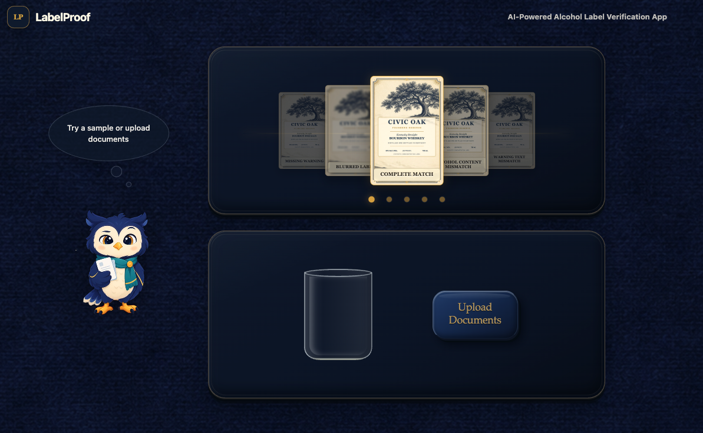
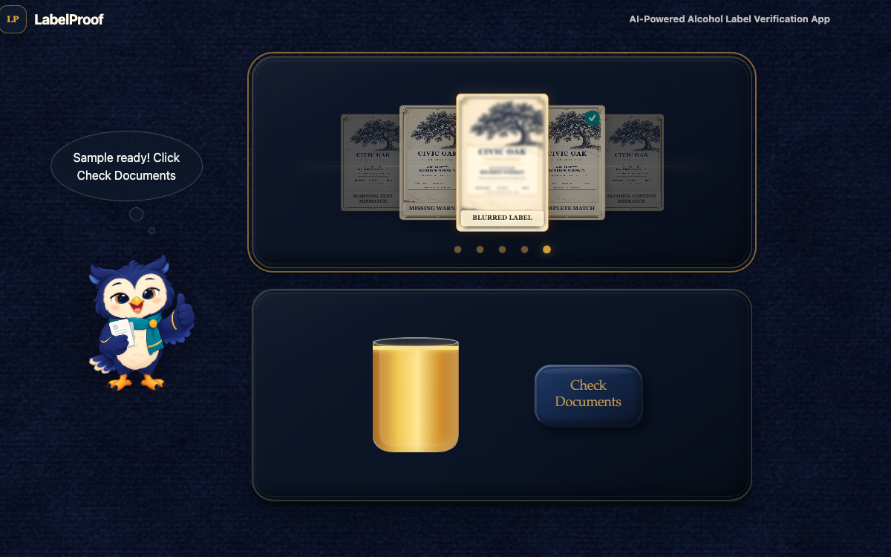
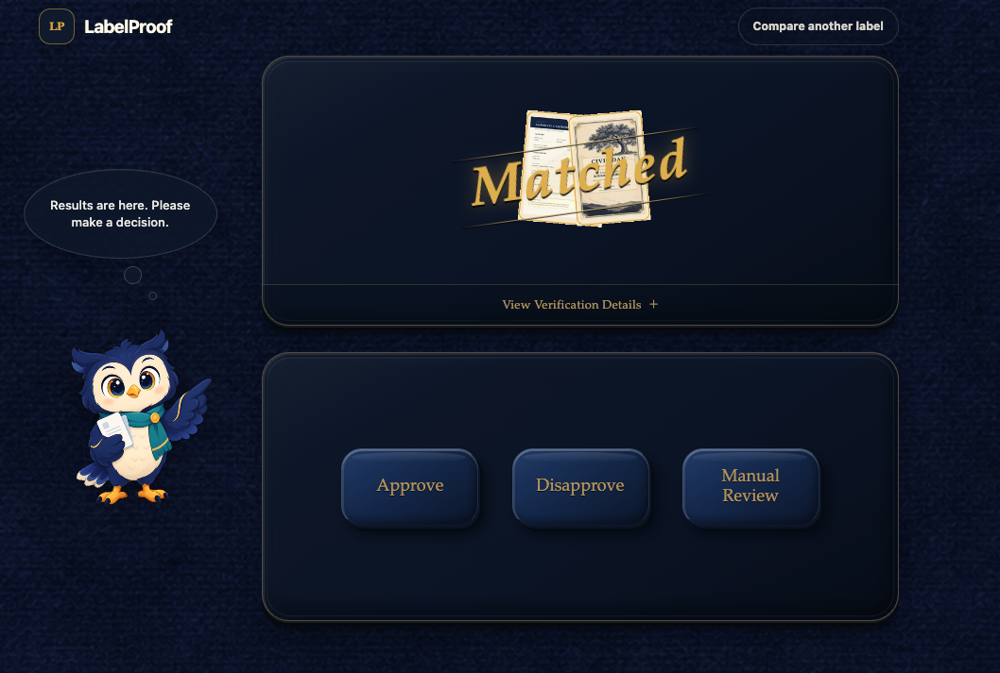
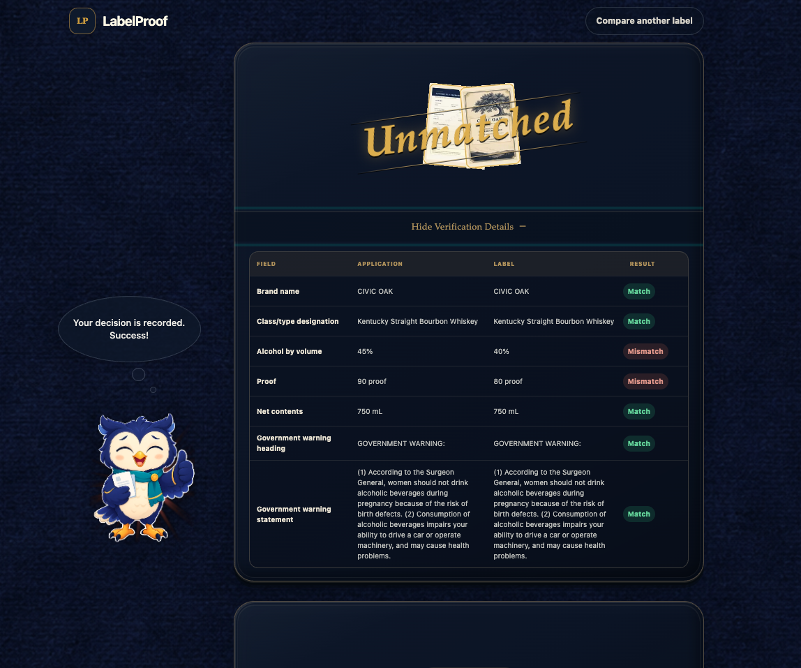
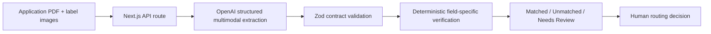

# LabelProof

**AI-powered alcohol label verification, designed for human review.**

[Open the live prototype](https://labelproof-phi.vercel.app)

LabelProof is a standalone take-home prototype for the U.S. Department of the
Treasury. It compares an alcohol-beverage application PDF with label artwork,
then presents a clear verification result for a reviewer to assess.

It is an AI-assisted verification tool—not an autonomous label-approval
system. A person always makes the routing decision.

## What the prototype demonstrates

- Upload one application PDF, one front-label image, and one back-label image.
  One additional PNG/JPEG label image is optional.
- Or select one of five prepared scenarios: a complete match, alcohol-content
  mismatch, warning-text mismatch, missing-warning case, or blurred-label case.
- Extract structured observations from both document sources using the OpenAI
  Responses API.
- Compare the extracted fields with deterministic, field-specific rules.
- Return one clear machine result: **Matched**, **Unmatched**, or **Needs
  Review**.
- Reveal the expected value, detected value, status, and explanation only when
  the reviewer requests verification details.
- Let the reviewer choose **Approve**, **Disapprove**, or **Manual Review**.
- Handle uncertain evidence safely: uncertain or missing required evidence
  never becomes a silent match.

The prepared samples use the same upload, extraction, and verification path as
the normal workflow; their outcomes are not hard-coded.

## Thirty-second walkthrough

1. Open the [live prototype](https://labelproof-phi.vercel.app).
2. Choose a sample from the carousel, or upload an application PDF and label
   artwork together.
3. Select **Check Documents**. Analysis starts as soon as the documents are
   ready, so the result screen can appear immediately.
4. Review the large result, optionally open **View verification details**, and
   make the final routing decision.

## Demo

<table>
  <tr>
    <td width="50%" align="center">
      
      <br />
      <sub>Choose a prepared scenario or upload documents.</sub>
    </td>
    <td width="50%" align="center">
      
      <br />
      <sub>Documents are ready for comparison.</sub>
    </td>
  </tr>
  <tr>
    <td width="50%" align="center">
      
      <br />
      <sub>The result is clear; the reviewer still makes the decision.</sub>
    </td>
    <td width="50%" align="center">
      
      <br />
      <sub>Field-level evidence is available on demand.</sub>
    </td>
  </tr>
</table>

## Verification scope

| Field | Approach |
| --- | --- |
| Brand name | Normalizes case, whitespace, apostrophes, Unicode, and nonmaterial punctuation. |
| Class/type | Normalizes presentation differences and flags material differences. |
| Alcohol content | Parses ABV and proof, compares values, and checks their mathematical relationship. |
| Net contents | Parses quantity and unit, then compares normalized units. |
| Government warning | Applies stricter verbatim wording, punctuation, and heading-capitalization checks. |

An overall **Unmatched** result takes precedence when a definite discrepancy
exists. **Needs Review** is used where evidence is unreadable, missing, or too
uncertain for a safe determination.

## Product design

The interface deliberately avoids a technical dashboard or report-like
workflow. It uses a small owl guide, large actions, short instructions, and an
expand-on-demand evidence table so that nontechnical reviewers can focus on
the decision rather than the implementation. The UI is designed to provide the best user experiences: 

- Smooth pointer, touch, and keyboard carousel motion
- One sample at a time, avoiding a crowded screen
- Visible upload progress through the water vessel
- Short guidance and large actions for nontechnical users

The machine result supports the review; it does not make decisions for humans. At the end, government reviewers alone select Approve, Disapprove, or Manual
Review after examining the result and, when needed, the details.

## Architecture



The extraction model observes the documents; it does not make the final
compliance decision. Its structured response is validated before the
verification engine uses it. Keeping extraction and verification separate
makes the rules explainable, testable, and replaceable independently of the AI
provider.

### Technology choices

| Area | Selection | Why |
| --- | --- | --- |
| Web application | Next.js + TypeScript | One deployable application with a responsive interface and server API. |
| AI extraction | OpenAI Responses API | Reads the application PDF and label images into one structured extraction contract. |
| Extraction model | `gpt-5.6-luna` | Selected for the MVP because it produced correct results on the prepared label cases and is positioned for cost-sensitive, high-volume workloads. |
| Validation | Zod | Treats AI output as untrusted input and enforces a canonical schema. |
| Verification | TypeScript rule modules | Makes comparisons deterministic, explainable, and unit-testable. |
| Test runner | Vitest | Fast coverage for parsing, normalization, comparison, contracts, and overall status. |
| Deployment | Vercel | Simple public deployment for this self-contained demonstration. |

### Model selection

`gpt-5.6-luna` is the submitted prototype's extraction model. It produced
correct results on the prepared cases and was selected over Terra after the
same complete-match fixture passed on both models but took 7.78 seconds on a
warm Luna run and 9.47 seconds on one Terra run. This is a small benchmark,
not a general latency guarantee.

## Run locally

### Prerequisites

- Node.js 24 or later
- An OpenAI API key with access to the configured extraction model

### Setup

```bash
git clone https://github.com/quintian/LabelProof.git
cd LabelProof
npm install
cp .env.example .env.local
```

Set the following server-side value in `.env.local`:

```bash
OPENAI_API_KEY=your_key_here
```

Optional model override:

```bash
OPENAI_EXTRACTION_MODEL=gpt-5.6-luna
```

The override exists only for controlled local evaluation; a different model
should not be substituted without rerunning the prepared-sample checks.

Then start the app:

```bash
npm run dev
```

Open [http://localhost:3000](http://localhost:3000).

Never commit `.env.local` or an API key. Vercel production uses the same key
as a sensitive environment variable named `OPENAI_API_KEY`.

## Quality checks

```bash
npm run lint
npm run typecheck
npm run test
npm run build
```

The test suite covers the extraction/verification contracts and the core
comparison rules, including normalization, ABV/proof, net contents,
government-warning checks, uncertainty, and overall-status precedence.

## Operational boundaries and limitations

This is a focused prototype, not a production TTB system.

- It covers a selected set of common alcohol-label fields and does not claim
  complete TTB regulatory coverage or beverage-specific exception handling.
- It accepts a PDF application and up to three label images, with a combined
  3 MB upload limit for the Vercel prototype.
- The application, front label, and back label are all required before analysis
  begins. An incomplete upload is blocked on the submission screen.
- In the single-picker prototype, the first selected image is treated as the
  front label and the second as the back label.
- The model may be slow or unable to read poor-quality, distorted, or obscured
  artwork. Those cases should be routed to **Needs Review**.
- Warning wording and heading capitalization can be checked from document
  evidence. Physical type size, boldness, contrast, placement, and other
  real-world formatting properties still require human review.
- A reviewer decision is a demonstration-only browser-session interaction; it
  is not stored as a case record or sent to an external workflow.
- Uploaded documents are processed for the request; this prototype does not
  implement persistent document storage or a records-retention system.

The following are intentionally not part of this standalone demo: COLA
integration, federal authentication, FedRAMP authorization, production records
management, production monitoring/queues, and a full batch-processing system.
They are not deferred deliverables for this project.

## Future extensions

If this prototype moved beyond the take-home context, the next priorities
would be a dedicated OCR and layout-extraction adapter, an approved enterprise
extraction provider or local model option, representative-label evaluation,
accessibility research with reviewers, and a batch workflow with a manifest,
progressive results, recovery, and export. A dedicated OCR adapter could add
word-level locations and image-preprocessing controls while keeping the
field-specific verification engine unchanged. Those features are deliberately
excluded from the current MVP to keep its single-review flow reliable and
polished.

## Source requirement context

This project was designed in response to the stakeholder interviews and
deliverables in the [Treasury take-home instructions](https://github.com/treasurytakehome-rgb/instructions/blob/main/README.md).
