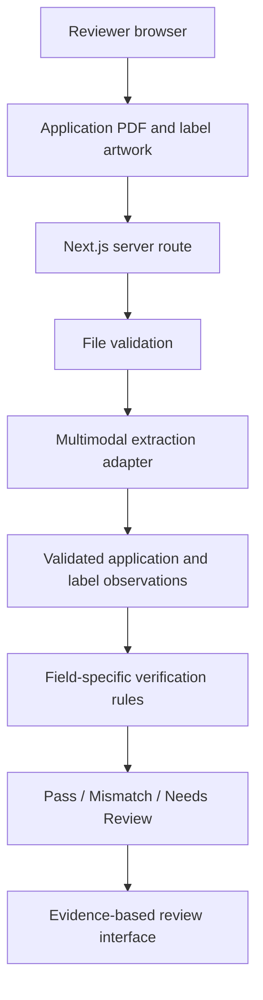

# LabelProof

**AI-assisted alcohol beverage label verification**

LabelProof is a polished, human-in-the-loop prototype for comparing alcohol
beverage label artwork with expected application data. It is being developed as
a take-home demonstration of applied AI engineering for the U.S. Department of
the Treasury.

The application extracts expected values from an application PDF, extracts
observed values from its label artwork, applies field-specific verification
rules, and presents the evidence to a reviewer. It does **not** approve or
reject labels autonomously; the reviewer retains the final decision.

> Project status: Phase 0 extraction spike and Phase 1 deterministic
> verification are complete. Phase 2 now uses a playful two-screen experience:
> a sample carousel plus guided upload screen, followed by a dominant machine
> result plus reviewer-routing screen. Four prepared scenarios exercise Match,
> Mismatch, and Needs Review through the same live analysis path. Detailed field
> results remain available on demand.

## Source requirements

The project is based on the discovery notes and deliverables in the
[Treasury take-home instructions](https://github.com/treasurytakehome-rgb/instructions/blob/main/README.md).
The requirements are primarily embedded in stakeholder interviews rather than
expressed as a formal specification.

## Submission scope

The initial submission will prioritize one visually polished vertical slice:

> Upload an application PDF and its label artwork, extract both with AI, compare
> them with deterministic rules, and present an evidence-based review.

LabelProof verifies a focused set of common fields across beer, wine, and
distilled spirits. Prepared demonstrations emphasize distilled spirits and do
not claim comprehensive beverage-specific regulatory coverage. Breadth will not
come at the expense of a finished core experience.

### In scope

- Common alcohol beverage label fields, demonstrated primarily with distilled
  spirits
- Application PDF upload and AI-assisted extraction of expected values
- Prepared application-and-label samples that exercise the real analysis path
- Manual application entry as a secondary fallback and correction mechanism
- One required front/brand label image
- Up to two optional back/additional label images
- PNG and JPEG label artwork
- AI-assisted extraction of application and label fields
- Verification of:
  - brand name
  - class/type designation
  - alcohol by volume and proof
  - net contents
  - required government warning text and heading capitalization
- Field-level `Pass`, `Mismatch`, and `Needs Review` results
- Overall review status
- Reviewer-selected workflow action, retained only for the active browser session
- Expected and detected values shown side by side
- Plain-language explanations and extracted evidence
- Processing-time measurement
- Prepared sample labels covering representative outcomes
- Clear upload, validation, extraction, and API error states
- Responsive and accessible interface
- Publicly accessible deployed prototype
- Automated tests for core verification rules
- Setup, architecture, assumptions, and limitation documentation

### Optional prototype enhancements

These will be considered only after the submission MVP is stable:

- Small batch workflow and results export
- Additional image preprocessing
- A larger 300-image batch demonstration

### Explicitly out of scope

These are not planned for this standalone take-home prototype:

- Autonomous regulatory approval or rejection
- Complete coverage of all TTB regulations and beverage-specific exceptions
- Evidence bounding boxes
- Producer/bottler name and address verification
- Country-of-origin verification
- Batch processing in the initial submission
- Direct COLA integration
- Federal authentication or identity integration
- Persistent reviewer decisions, case records, or workflow submission
- FedRAMP deployment or authorization work
- Formal government records-retention implementation
- Production-scale queues, infrastructure, and monitoring
- Fully offline or locally hosted AI inference
- Guaranteed interpretation of unreadable, severely distorted, or obscured labels

## Requirements traceability

This table distinguishes source requirements from implementation choices. A
status of `Planned` does not claim that the feature has already been completed.

| Stakeholder requirement | LabelProof response | Initial status |
| --- | --- | --- |
| Compare application information with label artwork | Extract both the application PDF and label artwork, then perform field-level verification | Planned |
| Reduce routine manual checking | Direct reviewers to mismatches and uncertain fields | Planned |
| Preserve human judgment and nuance | Three-state recommendations; reviewer makes the final decision | Planned |
| Return results in approximately five seconds | Target a normal warm application-and-label review at about five seconds and display measured latency | Planned |
| Be usable by nontechnical employees | One primary workflow, large controls, readable type, and plain language | Planned |
| Accept reasonable textual variations | Apply field-specific normalization instead of generic exact matching | Planned |
| Enforce strict warning-statement requirements | Deterministic wording, punctuation, and heading-capitalization checks | Planned |
| Explain the result | Show expected value, detected value, evidence, status, and reason for every field | Planned |
| Handle uncertain or unreadable images safely | Return `Needs Review` rather than guessing | Planned |
| Support 200–300 application batches | Excluded from the initial submission; possible post-submission prototype enhancement | Not in initial MVP |
| Demonstrate modernization potential | Use a provider-independent extraction boundary and testable rules | Planned |

## Product workflow

### 1. Supply the application

The default workflow lets the reviewer upload an application PDF or choose a
prepared sample. AI extracts:

- beverage category
- brand name
- class/type designation
- alcohol by volume and, when applicable, proof
- net contents

The reviewer can correct extracted values before verification. Manual entry is
available as a secondary fallback, not the primary demonstration path.

### 2. Upload label artwork

The reviewer supplies a required front/brand label plus up to two optional
back/additional labels. This allows the warning statement and other required
fields to appear on different parts of the packaging without turning the MVP
into a general multi-document workflow.

### 3. Analyze the label

The server validates the files, asks a multimodal model for separate structured
application and label observations, validates the response, and applies
deterministic field-specific comparison rules.

### 4. Review evidence and discrepancies

Every field displays:

| Expected | Detected | Status | Explanation |
| --- | --- | --- | --- |
| Stone's Throw | STONE'S THROW | Pass | Capitalization normalized |
| 45% Alc./Vol. | 40% ALC./VOL. | Mismatch | Alcohol content differs by 5 percentage points |
| 750 mL | Unreadable | Needs Review | The image did not provide reliable evidence |

The overall result is advisory. LabelProof does not make a legally binding
decision.

## Verification policies

A single generic fuzzy-match score is not appropriate for all label fields.

| Field | Planned comparison policy |
| --- | --- |
| Brand name | Normalize case, whitespace, Unicode, apostrophes, and nonmaterial punctuation; use conservative fuzzy matching only when needed |
| Class/type | Normalize case and spacing; tolerate limited presentation differences while flagging materially different classifications |
| Alcohol content | Parse numeric ABV and proof, compare normalized values, and verify their mathematical relationship |
| Net contents | Parse quantity and unit and normalize equivalent measurements before comparison |
| Government warning | Use strict wording and punctuation comparison, strict heading capitalization, and separate visual-format assessment |

Boldness, physical type size, and real-world dimensions cannot always be proven
from a digital photograph. The prototype will return `Needs Review` when those
visual properties cannot be established reliably.

The required wording and formatting boundary follow TTB's official
[Distilled Spirits Labeling: Health Warning Statement](https://www.ttb.gov/regulated-commodities/beverage-alcohol/distilled-spirits/ds-labeling-home/ds-health-warning).
The deterministic rule ignores layout-only line wrapping but preserves strict
case and punctuation. Boldness, physical type size, separation, and contrast
are not claimed as automated passes in the MVP.

## Visual design direction

LabelProof should feel playful, calm, and immediately understandable rather
than like a government report, technical dashboard, or implementation document.

- A polished owl guide uses short HTML speech bubbles to direct the next action
- Large readable typography, generous spacing, and obvious click targets
- Warm navy, teal, gold, cream, coral, and violet palette
- One clear primary action on the submission screen
- One prepared sample at a time with arrows, dots, and touch swipe support
- One visually dominant machine result before any detailed fields
- Technical details hidden from the normal user path
- Restrained motion with reduced-motion support
- Responsive behavior for desktop and smaller screens

Prepared demonstrations include:

1. a fully matching label
2. an alcohol-content mismatch
3. a government-warning problem
4. an ambiguous or low-quality image that requires human review

Each sample passes through the same extraction and verification path as a
user upload; sample results will not be hard-coded.

The submission screen contains only a sample carousel and one upload panel with
application and label-artwork targets. Its primary action is `Compare documents`.
The result screen contains only the machine result and routing decision. Field
comparisons are hidden behind `View verification details`; model names, token
counts, and extraction timing are not exposed to normal users.

## Tool selection

| Area | Selection | Reason |
| --- | --- | --- |
| Application framework | Next.js with TypeScript | One codebase for the interface and server API, reducing integration and deployment overhead |
| Styling | Tailwind CSS | Rapid visual iteration and consistent responsive styling |
| UI primitives | shadcn/ui | Accessible, professional primitives that remain easy to customize |
| Forms | React Hook Form | Clear structured form state and validation feedback |
| Runtime validation | Zod | Shared validation for form data, API payloads, and AI output |
| AI integration | OpenAI Responses API | Multimodal image input with structured text output |
| Initial model candidate | `gpt-5.6-luna` | Start with low or no reasoning for a bounded extraction task and the five-second latency target |
| Quality fallback candidate | `gpt-5.6-terra` | Compare only if the initial candidate misses small warning text or confuses fields |
| Client image preparation | Browser image resizing/compression | Keep the combined upload below the deployment limit before sending it to the server |
| Verification engine | TypeScript rule modules | Deterministic, explainable, and independently testable comparisons |
| Unit tests | Vitest | Fast tests for normalization, parsing, and verification rules |
| Browser tests | One focused Playwright smoke test | Protect the primary upload-to-results path without building a comprehensive browser suite |
| Deployment | Vercel | Low-friction deployment for the selected application stack |
| Continuous integration | GitHub Actions | Run type checking, linting, tests, and production builds |

The AI model performs visual extraction, not the final compliance decision. The
extraction provider will sit behind an interface so it can be changed without
rewriting the verification engine or user interface.

One model will be selected before submission; the interface will not expose a
model selector. Label images will use sufficient visual detail to read small
text, while application PDFs will use a lower-cost detail setting when testing
shows it is adequate. Warning text will be requested verbatim and responses will
remain concise to reduce latency.

### Deployment upload constraint

Vercel Functions currently limit request and response bodies to 4.5 MB. The MVP
will therefore enforce an approximately 3 MB combined limit for the application
PDF and label artwork, show that limit before upload, and resize/compress label
images in the browser. Prepared samples will remain below the same limit. Direct
object-storage uploads are unnecessary for this submission. See the official
[Vercel Functions limits](https://vercel.com/docs/functions/limitations#request-body-size).

The OpenAI Responses API accepts PDFs as file inputs and supplies both extracted
text and page images to vision-capable models. See the official
[OpenAI file-input documentation](https://developers.openai.com/api/docs/guides/file-inputs)
and [Structured Outputs guide](https://developers.openai.com/api/docs/guides/structured-outputs).

## Proposed architecture



Proposed source organization:

```text
src/
  app/
    api/analyze/
    review/
  components/
    application-upload/
    application-editor/
    label-preview/
    label-upload/
    review-results/
    sample-selector/
  lib/
    contracts/
      extraction.ts
      verification.ts
    ai/
      extractor.ts
      openai-extractor.ts
      extraction-schema.ts
    image/
      prepare-image.ts
    verification/
      brand.ts
      class-type.ts
      alcohol-content.ts
      net-contents.ts
      warning.ts
      overall-result.ts
    samples/
  types/
  tests/
docs/
  SCOPE.md
  ARCHITECTURE.md
```

## Core contracts

Application observations, label observations, and verification decisions will
remain separate.

```ts
type ExtractedField<T> = {
  value: T | null;
  verbatimText: string | null;
  readability: "clear" | "uncertain" | "not_found";
  source:
    | "application_pdf"
    | "reviewer_input"
    | "front_label"
    | "back_label"
    | "additional_label"
    | "none";
};

type DocumentExtraction = {
  application: {
    beverageCategory: ExtractedField<"beer" | "wine" | "distilled_spirits">;
    brandName: ExtractedField<string>;
    fancifulName: ExtractedField<string>;
    classType: ExtractedField<string>;
    alcoholByVolume: ExtractedField<number>;
    proof: ExtractedField<number>;
    netContents: ExtractedField<{ amount: number; unit: string }>;
  };
  label: {
    brandName: ExtractedField<string>;
    fancifulName: ExtractedField<string>;
    classType: ExtractedField<string>;
    alcoholByVolume: ExtractedField<number>;
    proof: ExtractedField<number>;
    netContents: ExtractedField<{ amount: number; unit: string }>;
    governmentWarningHeading: ExtractedField<string>;
    governmentWarningBody: ExtractedField<string>;
  };
};

type FieldResult = {
  field: VerificationField;
  label: string;
  expected: {
    displayValue: string | null;
    evidence: ApplicationEvidence | null;
  };
  detected: {
    displayValue: string | null;
    evidence: LabelEvidence | null;
  };
  status: "pass" | "mismatch" | "needs_review";
  explanation: string;
};
```

Model-reported confidence is intentionally excluded because it is not a
calibrated probability. `uncertain` and required `not_found` observations will
never silently become a pass; the verification engine converts them to `Needs
Review`. The executable Zod schemas in `src/lib/contracts/` are the source of
truth; the abbreviated types above explain their boundaries.

## Implementation plan

### Phase 0: Model and latency spike

- Obtain or create the four representative application-and-label cases
- Send the application PDF and label artwork to `gpt-5.6-luna`
- Validate structured output and verbatim warning extraction
- Measure warm end-to-end latency
- Compare `gpt-5.6-terra` only if the initial candidate is unreliable
- Select one model and reasoning setting for the submission

**Exit condition:** representative documents can be extracted reliably enough
for the intended demonstration. Adjust scope before UI investment if warning
extraction or latency is unacceptable.

#### Phase 0 result — complete-match sample

On August 11, 2026, `gpt-5.6-luna` extracted the synthetic application PDF,
front label, and back label with low PDF detail, high image detail, and no
reasoning tokens.

| Trial | Input cache | Extraction checks | API latency |
| --- | --- | ---: | ---: |
| Initial | Cache write | 17/17 after correcting the benchmark boundary | 11.95 s |
| Warm repeat | 7,095 cached input tokens | 17/17 | 7.78 s |

The warning heading and full warning body were reproduced verbatim, including
capitalization, numbered clauses, and punctuation. The initial benchmark had
incorrectly expected the abstract value `distilled_spirits` to appear on the
label itself; the label correctly contained the more specific class/type text,
so label-only beverage category inference is not scored.

The extraction quality supports retaining `gpt-5.6-luna` for the MVP. The warm
latency remains above the approximately five-second stakeholder goal, so the UI
will show meaningful progress and latency will be revisited after the complete
vertical slice is measured. A second model is not justified by extraction
quality at this stage.

### Phase 1: Contracts and deterministic verification

**Progress:** Core extraction and verification-result contracts are complete
and covered by strict schema tests. Brand-name and class/type normalization and
comparison are also complete. ABV/proof parsing, range validation, comparison,
and relationship checks are complete. Net-content parsing, unit conversion, and
comparison are complete. Strict government-warning heading and body checks are
complete. Overall-status precedence, field-summary counts, optional-proof
handling, and the complete deterministic verification pipeline are complete.

**Phase status: Complete.** The complete-match fixture produces seven field
passes; definite discrepancies take precedence in the overall result, while
uncertainty produces `Needs Review` when no definite mismatch exists.

- Define separate application, label, and result schemas
- Implement brand-name normalization
- Implement class/type comparison
- Parse and compare ABV and proof
- Parse and normalize net-content units
- Verify government-warning wording, punctuation, and heading capitalization
- Derive the overall three-state result
- Add unit tests for matching, mismatching, and ambiguous cases

**Exit condition:** matching, mismatching, missing, and unreadable observations
produce correct and explainable results without depending on an AI service.

### Phase 2: Polished vertical slice

**Progress:** The responsive two-screen interface, four-scenario Civic Oak
carousel, application PDF upload, multi-image label upload, file-type validation,
accessible feedback, owl guidance, and primary comparison action are implemented.
The live endpoint sends the PDF at
low detail and up to three label images at high detail to `gpt-5.6-luna`,
validates structured output with the canonical contracts, runs deterministic
verification, and returns field evidence plus measured latency. The interface
stops after 32 seconds client-side, presents one dominant result, reveals field
details on request, maps the recommendation to one of three visibly connected
routing choices, and supports starting a new review.

The production build, no-token API validation path, and prepared-sample browser
success path pass. The first integrated browser run reached the results view in
approximately two to three seconds in the local development environment. This
is an observed prototype result, not a production latency guarantee.

The normal workflow does not display implementation metadata or require an
intermediate extraction-confirmation form. The existing deterministic
`/api/verify` route and correction component remain available in the codebase
for a future optional edit flow, but they are not part of the streamlined demo.

- Scaffold and style the Next.js application
- Add application PDF upload, prepared samples, and manual correction
- Add required front-label and optional back/additional-label uploads
- Enforce combined upload size and client-side image compression
- Connect the live structured extraction endpoint
- Validate model output with Zod
- Complete image tabs, zoom, and label preview
- Add clear analysis progress and skeleton states
- Present expected and detected values in accessible result cards
- Display expandable verbatim evidence and plain-language explanations
- Add retry and recovery for expected failure modes
- Verify responsive behavior and keyboard accessibility
- Refine transitions and visual hierarchy

**Exit condition:** each prepared case travels through the real extraction and
verification path, and the complete workflow is understandable without
instruction.

### Phase 3: Hardening and delivery

- Repeat the four prepared cases and record latency
- Run verification unit tests and a focused browser smoke test
- Validate file types, size limits, and error recovery
- Confirm the API credential never reaches the browser
- Test the production build and public deployment
- Test the deployed workflow in another browser
- Complete setup instructions, screenshots, assumptions, and limitations
- Capture a short fallback demonstration recording
- Perform one focused reviewer revision pass

**Exit condition:** the public link, repository, and prepared demonstration are
stable and reproducible.

## Delivery priorities

If time becomes constrained, work will be reduced in this order:

1. Keep the single-application review workflow reliable.
2. Keep the verification rules correct and explainable.
3. Keep the application-PDF plus multi-label vertical slice visually polished.
4. Keep deployment and prepared samples reliable.
5. Reduce optional fields or sample count if necessary.
6. Do not add batch processing until the submission MVP is stable.

## Assumptions and limitations

- The default path extracts expected application values from a PDF; prepared
  samples and manual correction keep the demonstration accessible.
- One application may include one required front label and up to two optional
  back/additional labels.
- Only fields exposed by the application form are evaluated.
- The system assists a reviewer and does not make a legally binding decision.
- Normalization and comparison policies are field-specific.
- The five-second target applies to a normal application-and-label request after
  the service is warm, and actual latency will be measured rather than assumed.
- Warning wording and heading capitalization can be checked deterministically;
  physical type size and some visual formatting may require human review.
- Model output is treated as untrusted input and validated before use.
- Readability describes observed evidence and is not presented as a calibrated
  model-confidence probability.
- The combined upload is limited to approximately 3 MB for the initial Vercel
  deployment.
- The prototype does not claim comprehensive TTB compliance.

## Future README updates

This README intentionally preserves planning decisions during development.
Before submission it will be rewritten as an evaluator-facing project page and
will no longer lead with planning status, long planned-feature lists, or
implementation phases. The final structure will prioritize:

- live application URL
- screenshot and thirty-second workflow
- implemented features
- architecture and AI/verification design
- finalized setup and run commands
- environment-variable documentation
- test commands and current results
- measured latency on representative labels
- design decisions, final tradeoffs, and known limitations
